<!-- AOC TILES BEGIN -->
<h1 align="center">
  2022 - 6 ⭐
</h1>
<a href="2022/python/01_Calorie_Counting.py">
  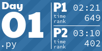
</a>

<a href="2022/python/03.py">
  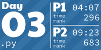
</a>
<h1 align="center">
  2021 - 50 ⭐
</h1>

<a href="2021/02_dive.py">
  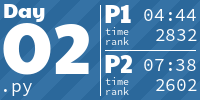
</a>

<a href="2021/06_lanternfish.py">
  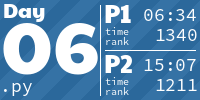
</a>
<a href="2021/07_the_treachery_of_whales.py">
  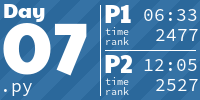
</a>

<a href="2021/09_smoke_basin.py">
  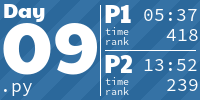
</a>
<a href="2021/10_syntax_scoring.py">
  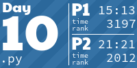
</a>
<a href="2021/11_dumbo_octopus.py">
  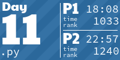
</a>
<a href="2021/12_passage_pathing.py">
  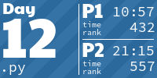
</a>
<a href="2021/13_transparent_origami.py">
  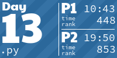
</a>
<a href="2021/14_extended_polymerization.py">
  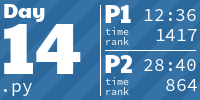
</a>
<a href="2021/15_chiton.py">
  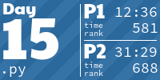
</a>
<a href="2021/16_packet_decoder.py">
  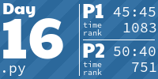
</a>

<a href="2021/18_snailfish .py">
  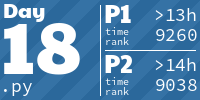
</a>
<a href="2021/19_beacon_scanner.py">
  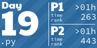
</a>
<a href="2021/20_trench_map.py">
  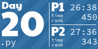
</a>
<a href="2021/21_dirac_dice.py">
  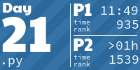
</a>

<a href="2021/23 copy 2.py">
  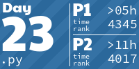
</a>

<a href="2021/25_sea_cucumber.py">
  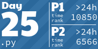
</a>
<h1 align="center">
  2020 - 50 ⭐
</h1>
<a href="2020/01.py">
  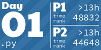
</a>
<a href="2020/02.py">
  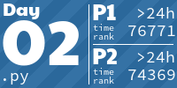
</a>

<a href="2020/04.py">
  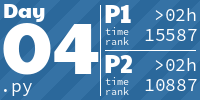
</a>
<a href="2020/05.py">
  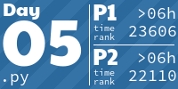
</a>
<a href="2020/06.py">
  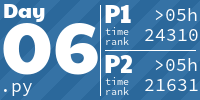
</a>
<a href="2020/07.py">
  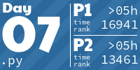
</a>
<a href="2020/08.py">
  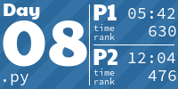
</a>
<a href="2020/09.py">
  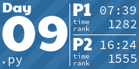
</a>

<a href="2020/11.py">
  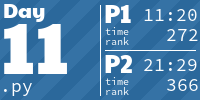
</a>
<a href="2020/12.py">
  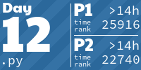
</a>
<a href="2020/13.py">
  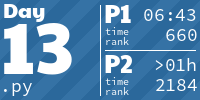
</a>

<a href="2020/15.py">
  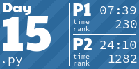
</a>

<a href="2020/17.py">
  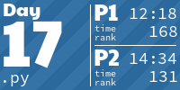
</a>
<a href="2020/18.py">
  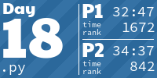
</a>
<a href="2020/19.py">
  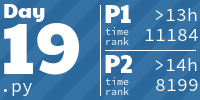
</a>
<a href="2020/20.py">
  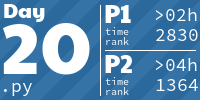
</a>
<a href="2020/21.py">
  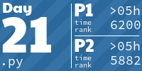
</a>
<a href="2020/22.py">
  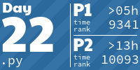
</a>
<a href="2020/23.py">
  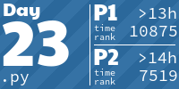
</a>

<a href="2020/25.py">
  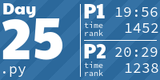
</a>
<h1 align="center">
  2015 - 48 ⭐
</h1>
<a href="2015/python/01_Not_Quite_Lisp.py">
  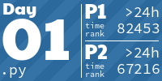
</a>

<a href="2015/python/03_Perfectly_Spherical_Houses_in_a_Vacuum.py">
  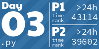
</a>

<a href="2015/python/06_Probably_a_Fire_Hazard.py">
  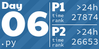
</a>
<a href="2015/python/07_Some_Assembly_Required.py">
  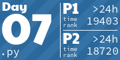
</a>
<a href="2015/python/08_Matchsticks.py">
  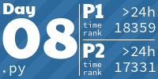
</a>
<a href="2015/python/09_All_in_a_Single_Night.py">
  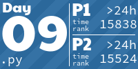
</a>
<a href="2015/python/10_Elves_Look_Elves_Say.py">
  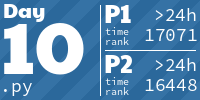
</a>
<a href="2015/python/11_Corporate_Policy.py">
  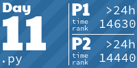
</a>

<a href="2015/python/13_Knights_of_the_Dinner_Table.py">
  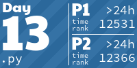
</a>
<a href="2015/python/14_Reindeer_Olympics.py">
  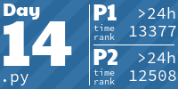
</a>
<a href="2015/python/15_Science_for_Hungry_People.py">
  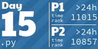
</a>

<!-- AOC TILES END -->