<!-- AOC TILES BEGIN -->
<h1 align="center">
  2023 - 10 ⭐
</h1>

<a href="2023/python/02_Cube_Conundrum.py">
  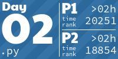
</a>

<a href="2023/python/04_Scratchcards.py">
  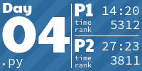
</a>
<a href="2023/python/05_If_You_Give_A_Seed_A_Fertilizer.py">
  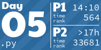
</a>
<h1 align="center">
  2022 - 48 ⭐
</h1>

<a href="2022/python/05_Supply_Stacks.py">
  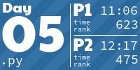
</a>

<a href="2022/python/07_No_Space_Left_On_Device.py">
  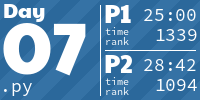
</a>
<a href="2022/python/08_Treetop_Tree_House.py">
  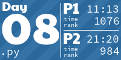
</a>
<a href="2022/python/09_rope_bridge.py">
  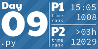
</a>
<a href="2022/python/10_cathode_ray_tube.py">
  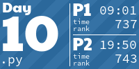
</a>
<a href="2022/python/11_Monkey_in_the_Middle.py">
  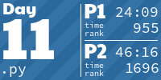
</a>
<a href="2022/python/12_Hill_Climbing_Algorithm.py">
  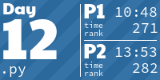
</a>
<a href="2022/python/13_Distress_Signal.py">
  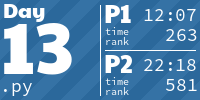
</a>
<a href="2022/python/14_Regolith_Reservoir.py">
  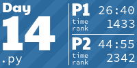
</a>
<a href="2022/python/15_Beacon_Exclusion_Zone.py">
  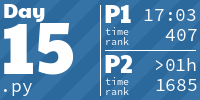
</a>
<a href="2022/python/16_Proboscidea_Volcanium.py">
  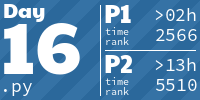
</a>
<a href="2022/python/17_Pyroclastic_Flow.py">
  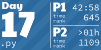
</a>
<a href="2022/python/18_Boiling_Boulders.py">
  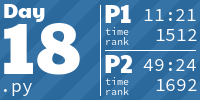
</a>

<a href="2022/python/20_Grove_Positioning_System.py">
  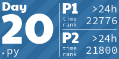
</a>

<a href="2022/python/22.py">
  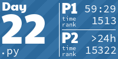
</a>

<a href="2022/python/24_Blizzard_Basin.py">
  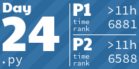
</a>
<a href="2022/python/25_Full_of_Hot_Air.py">
  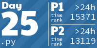
</a>
<h1 align="center">
  2021 - 50 ⭐
</h1>
<a href="2021/01_Sonar_Sweep.py">
  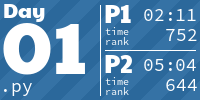
</a>

<a href="2021/05_hydrothermal_venture.py">
  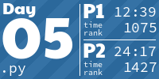
</a>

<a href="2021/10_syntax_scoring.py">
  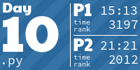
</a>

<a href="2021/16_packet_decoder.py">
  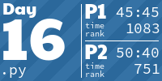
</a>
<a href="2021/17_trick_shot.py">
  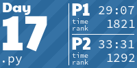
</a>

<a href="2021/22.py">
  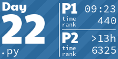
</a>

<h1 align="center">
  2020 - 50 ⭐
</h1>

<a href="2020/10.py">
  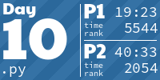
</a>
<a href="2020/11.py">
  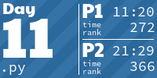
</a>

<a href="2020/20.py">
  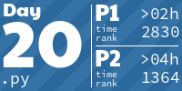
</a>

<h1 align="center">
  2016 - 32 ⭐
</h1>
<a href="2016/python/01_No_Time_for_a_Taxicab.py">
  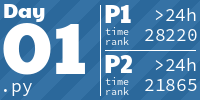
</a>

<a href="2016/python/03_Squares_With_Three_Sides.py">
  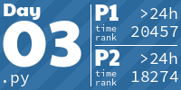
</a>

<a href="2016/python/10_Balance_Bots.py">
  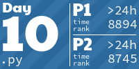
</a>

<a href="2016/python/12_Leonardoss_Monorail.py">
  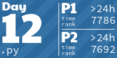
</a>
<a href="2016/python/13_Maze_of_Twisty_Little_Cubicles.py">
  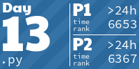
</a>
<a href="2016/python/14_One_Time_Pad.py">
  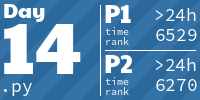
</a>
<a href="2016/python/15_Timing_is_Everything.py">
  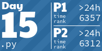
</a>

<h1 align="center">
  2015 - 50 ⭐
</h1>

<a href="2015/python/05_Doesnt_He_Have_Intern_Elves_For_This.py">
  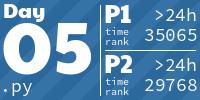
</a>

<a href="2015/python/11_Corporate_Policy.py">
  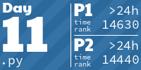
</a>
<a href="2015/python/12_JSAbacusFramework_io.py">
  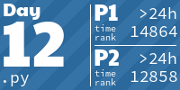
</a>

<!-- AOC TILES END -->